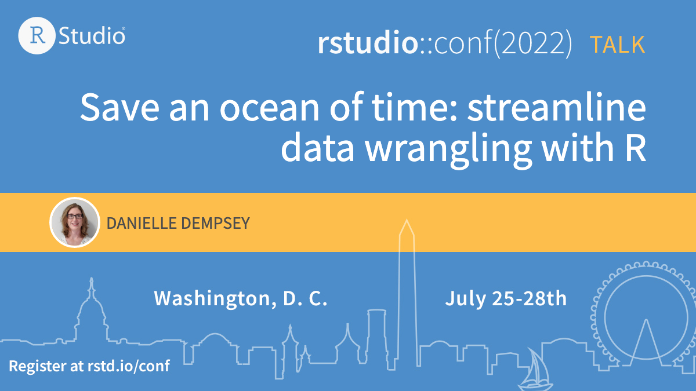

<!-- README.md is generated from README.Rmd. Please edit that file -->

# Save an ocean of time: streamline data wrangling with R

Material from my presentation at the 2022 rstudio::conf in Washington,
DC.

Presentation video is
[here](https://www.rstudio.com/conference/2022/talks/save-ocean-of-time-streamline/).

Slides are
[here](https://github.com/dempsey-CMAR/2022_rstudio_conf/blob/main/Dempsey_rstudio_conf_slides.pdf).

Slides with speaking notes & image attributions are
[here](https://github.com/dempsey-CMAR/2022_rstudio_conf/blob/main/Dempsey_rstudio_conf_slides_notes.pdf).

